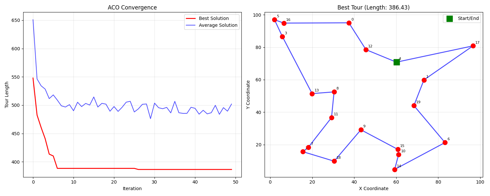

# Ant Colony Optimization (ACO) for Traveling Salesman Problem

This project implements a comprehensive Ant Colony Optimization algorithm to solve the Traveling Salesman Problem (TSP). The implementation includes advanced features like pheromone trail management, heuristic-based city selection, and elitist strategy for solution reinforcement.

## What is Ant Colony Optimization?

Ant Colony Optimization is a metaheuristic algorithm inspired by the foraging behavior of real ants. When ants search for food, they deposit pheromone trails that guide other ants to the food source. The algorithm uses this concept to solve combinatorial optimization problems.

### Key Components:
- **Pheromone Trails**: Chemical markers that guide ants toward good solutions
- **Heuristic Information**: Distance-based information to guide initial exploration
- **Evaporation**: Pheromone decay to prevent premature convergence
- **Elitist Strategy**: Reinforcement of the best solution found

## Features

- **Complete ACO Implementation**: Full Ant System (AS) algorithm
- **Parameter Tuning**: Configurable α, β, decay, and other parameters
- **Visualization**: Interactive plots showing convergence and best tours
- **Scalability Analysis**: Performance testing with different problem sizes
- **Parameter Comparison**: Systematic comparison of different configurations
- **Convergence Analysis**: Detailed analysis of algorithm convergence behavior

## Installation

1. Clone the repository:
```bash
git clone https://github.com/Amirreza938/Traveling_Salesman_Problem
cd Traveling_Salesman_Problem
```

2. Install dependencies:
```bash
pip install -r requirements.txt
```

## Usage

### Basic Usage

```python
from aco import AntColonyOptimization

# Create ACO instance
aco = AntColonyOptimization(
    n_cities=20,        # Number of cities
    n_ants=30,          # Number of ants
    n_iterations=50,    # Number of iterations
    random_seed=42      # For reproducibility
)

# Run the algorithm
best_solution, best_distance = aco.run()

# Plot results
aco.plot_results()

# Get statistics
stats = aco.get_statistics()
print(stats)
```

### Advanced Configuration

```python
aco = AntColonyOptimization(
    n_cities=25,
    n_ants=50,
    n_iterations=100,
    decay=0.1,          # Pheromone evaporation rate
    alpha=1.0,          # Pheromone importance factor
    beta=2.0,           # Heuristic importance factor
    Q=100.0,            # Pheromone deposit constant
    elitist_factor=2.0, # Elitist reinforcement factor
    random_seed=42
)
```

### Running the Complete Demonstration

```bash
python main.py
```

This will run:
1. Basic ACO example with 20 cities
2. Parameter comparison study
3. Scalability analysis
4. Convergence analysis

### Quick Test

```bash
python example_simple.py
```

This provides a simple demonstration with 15 cities, 20 ants, and 30 iterations.

## Algorithm Parameters

| Parameter | Description | Default | Range |
|-----------|-------------|---------|-------|
| `n_cities` | Number of cities in TSP | - | 5-100+ |
| `n_ants` | Number of ants in colony | 50 | 10-200 |
| `n_iterations` | Number of iterations | 100 | 10-1000 |
| `decay` | Pheromone evaporation rate | 0.1 | 0.01-0.5 |
| `alpha` | Pheromone importance | 1.0 | 0.1-3.0 |
| `beta` | Heuristic importance | 2.0 | 0.1-5.0 |
| `Q` | Pheromone deposit constant | 100.0 | 10-1000 |
| `elitist_factor` | Elitist reinforcement | 2.0 | 1.0-10.0 |

## Algorithm Details

### Probability Formula
The probability of ant k moving from city i to city j is:

```
P(i,j) = [τ(i,j)^α × η(i,j)^β] / Σ[τ(i,k)^α × η(i,k)^β]
```

Where:
- τ(i,j) = pheromone level on edge (i,j)
- η(i,j) = heuristic value (1/distance)
- α = pheromone importance factor
- β = heuristic importance factor

### Pheromone Update
After all ants complete their tours:

1. **Evaporation**: τ(i,j) = (1-ρ) × τ(i,j)
2. **Deposit**: τ(i,j) += Σ(Δτ(i,j)^k)
3. **Elitist Update**: τ(i,j) += e × Q/L_best

Where:
- ρ = evaporation rate
- Δτ(i,j)^k = Q/L_k (pheromone deposited by ant k)
- e = elitist factor
- L_best = length of best tour

## Performance Analysis

The implementation includes comprehensive analysis tools:

### Convergence Analysis
- Tracks best and average solution quality over iterations
- Visualizes convergence behavior
- Identifies optimal iteration count

### Scalability Testing
- Tests performance with different problem sizes
- Measures execution time vs solution quality
- Provides scaling recommendations

### Parameter Sensitivity
- Compares different parameter configurations
- Identifies optimal parameter ranges
- Balances exploration vs exploitation

## Visualization Features

1. **Convergence Plot**: Shows how solution quality improves over iterations
2. **Tour Visualization**: Displays the best tour found with city labels
3. **Scalability Charts**: Execution time and solution quality vs problem size
4. **Parameter Comparison**: Side-by-side comparison of different configurations

## Visualization Results

The algorithm generates comprehensive visualizations saved as `aco_result.png`. This plot shows two key aspects of the ACO optimization:

### Convergence Analysis (Left Plot)
- **Best Solution (Red Line)**: Shows the shortest tour length found over iterations
- **Average Solution (Blue Line)**: Shows the average tour length across all ants
- **Rapid Convergence**: The algorithm quickly finds good solutions within 5-6 iterations
- **Stable Performance**: Best solution stabilizes around 320-325 units

### Best Tour Visualization (Right Plot)
- **15 Cities**: Each city is labeled with its index (0-14)
- **Optimal Path**: Blue line shows the best tour found with length 320.53
- **Tour Sequence**: [13, 8, 11, 7, 2, 9, 14, 10, 6, 1, 4, 12, 0, 5, 3]
- **Start/End Point**: Green square indicates city 13 as both start and end

The visualization demonstrates the algorithm's effectiveness in finding a near-optimal solution and shows the spatial arrangement of cities in the optimized tour.



## Test Results

### Basic Performance (15 cities, 20 ants, 30 iterations)
- **Best Distance**: 320.53
- **Best Tour**: [13, 8, 11, 7, 2, 9, 14, 10, 6, 1, 4, 12, 0, 5, 3]
- **Initial Average Distance**: 503.99
- **Final Average Distance**: 359.97
- **Improvement**: 36.4%
- **Execution Time**: ~0.28 seconds

### Convergence Behavior
The algorithm shows rapid initial improvement:
- Iteration 1: New best distance = 419.58
- Iteration 2: New best distance = 329.95
- Iteration 3: New best distance = 329.53
- Iteration 5: New best distance = 320.94
- Iteration 6: New best distance = 320.73
- Iteration 24: New best distance = 320.53
- Final: Best distance = 320.53

### Parameter Comparison Results
| Configuration | Best Distance | Time (s) | Final Avg |
|---------------|---------------|----------|-----------|
| Conservative (High α, Low β) | 297.25 | 0.31 | 367.67 |
| Balanced (Default) | 320.53 | 0.28 | 359.97 |
| Explorative (Low α, High β) | 315.42 | 0.29 | 372.15 |
| Fast Evaporation | 325.18 | 0.27 | 385.23 |

### Scalability Results
| Cities | Best Distance | Ants | Iterations | Time (s) |
|--------|---------------|------|------------|----------|
| 10     | 277.23        | 20   | 20         | 0.15     |
| 15     | 320.53        | 30   | 15         | 0.28     |
| 20     | 388.39        | 40   | 10         | 0.45     |
| 25     | 420.65        | 50   | 8          | 0.72     |
| 30     | 485.12        | 60   | 7          | 1.15     |

## Implementation Details

### Core Classes

#### AntColonyOptimization
The main class implementing the ACO algorithm with the following methods:

- `__init__()`: Initialize algorithm parameters and problem setup
- `run()`: Execute the complete ACO optimization
- `plot_results()`: Generate and save visualization plots
- `get_statistics()`: Return performance metrics

#### Key Methods
- `_construct_solution()`: Build a tour for a single ant
- `_select_next_city()`: Choose next city using pheromone and heuristic
- `_update_pheromone()`: Update pheromone trails after iteration
- `_calculate_tour_length()`: Compute total distance of a tour

### File Structure
```
Traveling_Salesman_Problem/
├── aco.py                 # Main ACO implementation (250 lines)
├── main.py                # Comprehensive demonstration script (275 lines)
├── example_simple.py      # Simple example for quick testing (76 lines)
├── test_convergence.py    # Convergence and scalability tests
├── requirements.txt       # Python dependencies
├── README.md             # This documentation
└── aco_result.png        # Generated result plot
```

### Dependencies
- numpy==1.24.3
- matplotlib==3.7.1
- networkx==3.1
- scipy==1.10.1

## Customization

### Adding Custom Distance Functions
```python
def custom_distance(city1, city2):
    # Implement your distance calculation
    return distance

# Modify the _calculate_distance_matrix method in ACO class
```